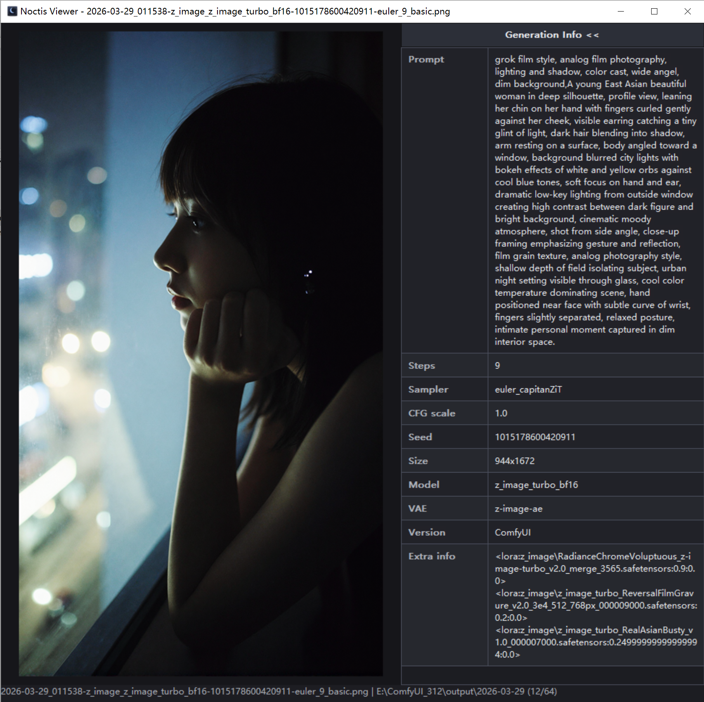
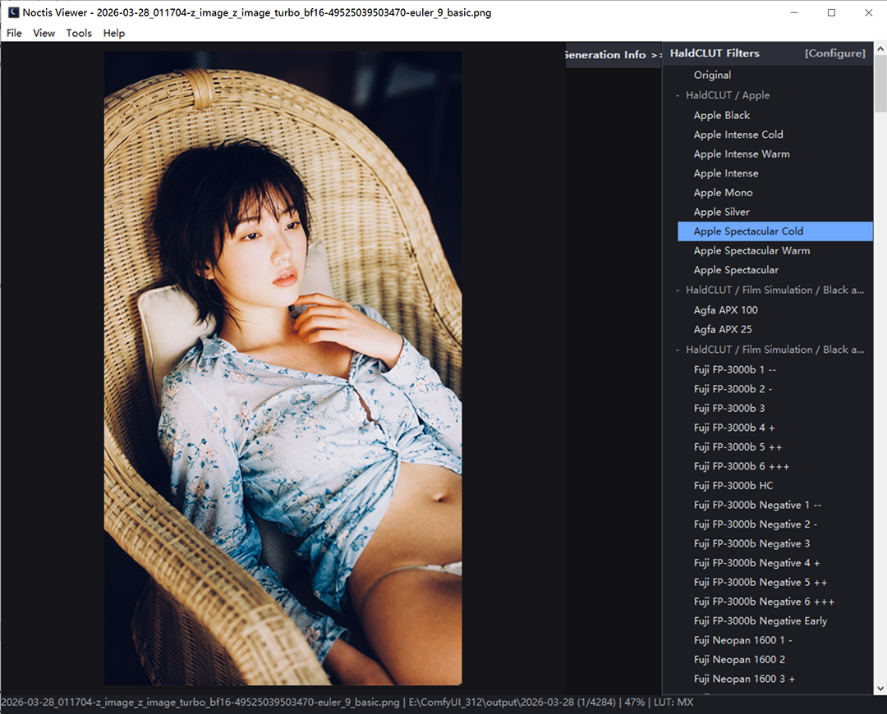

# Noctis Viewer v1.4.0

[English](README.md) | [简体中文](README.zh-CN.md) | [日本語](README.ja.md)

Noctis Viewer は、Windows 向けの軽量なネイティブ画像ビューアです。高速起動、素早い画像切り替え、そして AI 画像の生成情報確認に特化しています。

PNG に WebUI 互換の生成情報が含まれている場合、Noctis Viewer はその情報を右側の 2 列テーブルで表示します。一方で、ComfyUI の workflow JSON は意図的に表示せず、見やすさを優先しています。

v1.3 からは強力な HaldCLUT ワークフローも内蔵され、LUT の参照、リアルタイムプレビュー、比較、書き出しまで行えるようになりました。生成情報の確認だけでなく、手早いカラーグレーディング確認ツールとしても活用できます。




## 特長

- ネイティブ Win32 + GDI+ アプリケーション
- 軽量で高速起動
- 高 DPI ディスプレイ完全対応（100% - 300% スケーリング）
- PNG、JPG、JPEG、BMP、GIF、TIF、TIFF をサポート
- 矢印キーで前の画像 / 次の画像へ移動
- `Page Up` / `Page Down` でズームイン / ズームアウト
- `Ctrl + マウスホイール` でスムーズズーム
- `Home` / `End` で最初 / 最後の画像へジャンプ
- `Ctrl+O` でファイルダイアログを開く
- 空白領域をダブルクリックして画像を開く
- 読み込み時にウィンドウへ自動フィット
- ステータスバーにズーム率を表示
- ズーム時のスムーズなマウスドラッグパン
- メタデータパネルで値をクリックしてコピー可能
- HaldCLUT パネルで LUT を再帰的に読み込み
- HaldCLUT パネル先頭に `Original` を表示
- LUT 適用中に `Space` を押し続けると元画像を一時プレビュー
- HaldCLUT 適用モード:
  - `MX_LUT Compatible`
  - `Smooth Interpolation`
- `File > Save Current Preview As...` で現在のプレビューを書き出し
- ファイル関連付けサポート
- メニューバー（File / View / Tools / Help）
- ダブルバッファリングによるチラつきなし描画

## v1.4.0 の変更点

- **高 DPI ディスプレイ対応**: マルチモニター DPI 認識で、すべてのディスプレイで鮮明に表示
- **Ctrl + マウスホイール**: Ctrl キー修飾でスムーズにズームイン/アウト
- **Home / End キー**: 最初と最後の画像へのクイックナビゲーション
- **画像品質の向上**: 高品質 GDI+ レンダリング設定でより鮮明なスケーリング
- **パネルのチラつき除去**: スムーズなスクロールとドラッグのためのダブルバッファリング
- **キャッシュされたバックバッファ**: ズーム時のハードウェアアクセラレートによるスムーズなパン
- **非同期 LUT 読み込み**: LUT 選択時の応答性向上（選択状態が即座に更新）

## v1.3.1 の変更点

- テンキーでのズームサポート（`Num +` / `Num -`）
- ズーム時のマウスドラッグパン対応
- 画像ドラッグ中のパネルチラつきを修正
- HaldCLUT 読み込み進捗ダイアログを修正

## メタデータ表示方針

Noctis Viewer は WebUI 互換の情報のみを表示します。

- 表示対象: `parameters`、プレーンテキストの prompt
- 表示しない: ComfyUI の `prompt` / `workflow` JSON

## HaldCLUT クレジット

開発およびテストで使用した HaldCLUT コレクションは、次のプロジェクトから取得しました。

https://github.com/cedeber/hald-clut

すばらしい LUT コレクションを公開・保守している `hald-clut` プロジェクトと貢献者の皆さまに感謝します。

## 操作方法

| キー | アクション |
|------|------------|
| `Left`、`Up` | 前の画像 |
| `Right`、`Down` | 次の画像 |
| `Page Up` / `Num +` | ズームイン |
| `Page Down` / `Num -` | ズームアウト |
| `Ctrl + マウスホイール` | ズームイン / アウト |
| `Home` | 最初の画像へジャンプ |
| `End` | 最後の画像へジャンプ |
| `Ctrl+O` | ファイルダイアログを開く |
| `Delete` | 現在の画像を削除（確認あり） |
| `H` | HaldCLUT パネルの表示切替 |
| `Space` | LUT 適用中に押し続けて元画像をプレビュー |
| マウスホイール | 前 / 次の画像 |
| ドラッグ（ズーム時） | 画像をパン |
| 空白領域をダブルクリック | 画像を開く |
| メタデータ値をクリック | 値をコピー |
| HaldCLUT 項目をクリック | LUT を適用 |
| `Original` をクリック | 元画像表示に戻す |

## ビルド

### 必要環境

- Windows 10 以降
- CMake 3.10+
- Visual Studio Build Tools または C++ ワークロードを含む Visual Studio

### CMake でビルド

```powershell
cmake -S . -B build
cmake --build build --config Release
```

出力:

```text
bin\Release\Noctis_Viewer.exe
```

### 補助スクリプトでビルド

```powershell
.\build_native.bat
```

## ダウンロード

- `Noctis_Viewer-v1.4.0-x64.zip`

解凍して `Noctis_Viewer.exe` を実行するだけです。インストール不要です。

## システム要件

- Windows 10 以降
- 高 DPI ディスプレイ対応（100% - 300% スケーリングでテスト済み）
- 追加の依存関係は不要

## GitHub

<https://github.com/aiimagestudio/NoctisViewer>

## License

このプロジェクトは MIT License を採用しています。詳細は [LICENSE](LICENSE) を参照してください。
